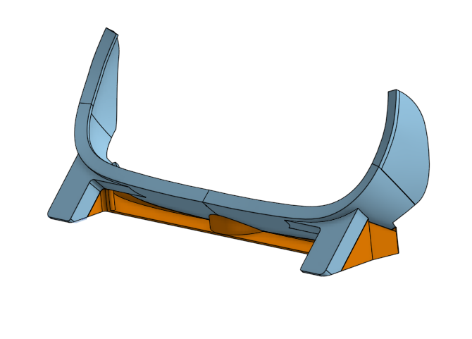

# Leap Tiltfive Testing
 Test scenes trying out different hand tracking interactions with Tiltfive AR glasses

## Introduction
 This repo includes example scenes exploring HMD and Desktop-mode hand tracking with the Tilt Five AR system. Each example highlights a different method of virtual interaction. The chess example demonstrates grid-snapping and object highlighting to make user intent clear. The virtual cursor example demonstrates two methods of projecting hand position onto the gameboard. The HMD-mode chess board example mounts the Ultraleap Stereo IR 170 device on the Tilt Five glasses using a 3D printed bracket. The other examples place the Ultraleap hand tracker next to the gameboard facing up at user.

## 3D Printed bracket (optional)
 For the HMD-mode tracked examples, the Ultraleap device is mounted to the glasses. The STL files can be found in "Assets > CAD Files" The mount was printed using a consumer FDM printer with the following settings:
-0.2mm layer height
-3 perimeters
-10% infill
-No supports

 The design includes sacrificial geometry instead of support material that needs to be removed (colored in orange in photo above). The mount adheres to the glasses using mounting tape, and the Ultraleap device is fastened using threadforming plastic screws. See the BOM in "Assets > CAD Files" for more info.

## 