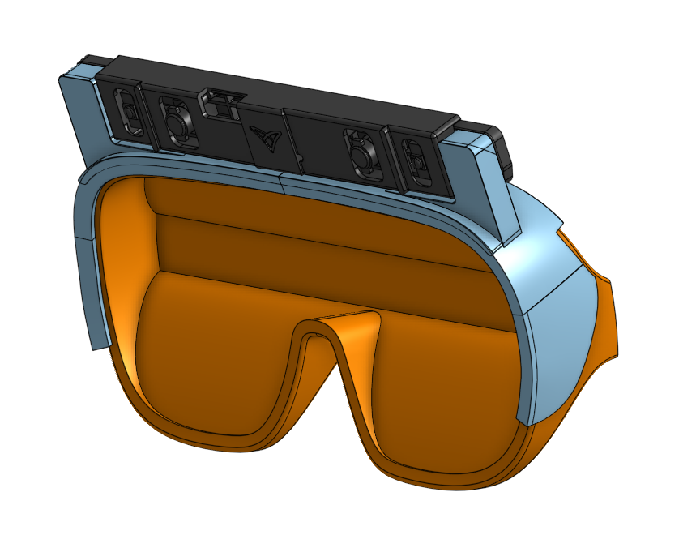
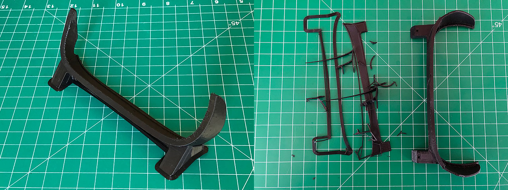

# Leap Tiltfive Testing
 Test scenes trying out different hand tracking interactions with Tiltfive AR glasses

## Introduction
 This repo includes example scenes exploring HMD and Desktop-mode hand tracking with the Tilt Five AR system. Each mode represents an expected Ultraleap tracking device orientation: mounted to the TiltFive glasses or laying next to the gameboard facing upward. Each Unity scene highlights a different method of virtual interaction. The 'Chess Game' example demonstrates grid-snapping and object highlighting to help make the user intent clear when interacting. The 'Hand Cursor' example demonstrates two methods of projecting hand position onto the gameboard. The 'Turntable' example demonstrates how to rotate around a virtual object with either hand. Note that each example is designed around the device orientation and that some interactions are better suited for certain device orientations. For example, the chess game interaction would not work well in Desktop-mode because the hand often exceeds the field of view of camera when reaching over the board.

## 3D Printed bracket (optional)
 For the HMD-mode tracked example such as the chess game, the Ultraleap device is mounted to the glasses. The STL files can be found in "Assets > CAD Files" The mount was printed using a consumer FDM printer with the following settings:
-0.2mm layer height
-3 perimeters
-10% infill
-No supports
-Skirt outlines or raft recommended

 The design includes sacrificial geometry instead of support material that needs to be removed (colored in orange in photo above). The mount adheres to the glasses using mounting tape, and the Ultraleap device is fastened using threadforming plastic screws. See the BOM in "Assets > CAD Files" for more info.

## Examples

 Note that each example is designed around the device orientation and that some interactions are better suited for certain device orientations. For example, the chess game interaction would not work well in Desktop-mode because the hand often exceeds the field of view of camera when reaching over the board. As an alternative, Hand Cursor scene demonstrates 2 methods of impelementing a virtual cursor to interact with your objects.

### Chess Game

### Hand Cursor

### Turntable