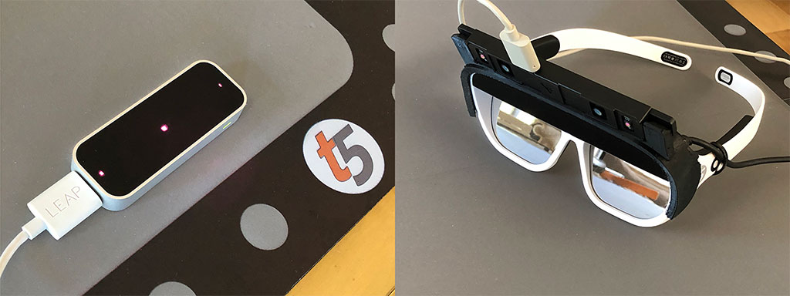
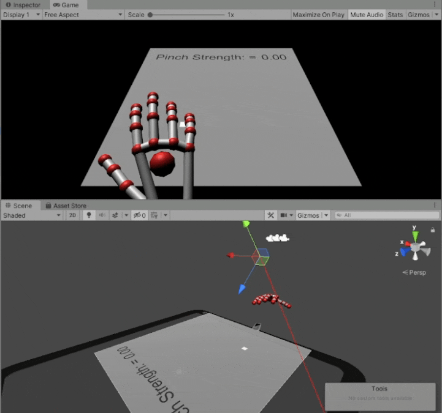
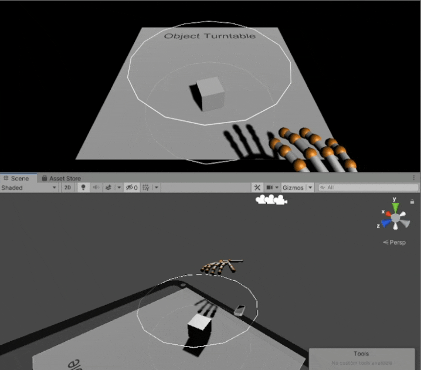
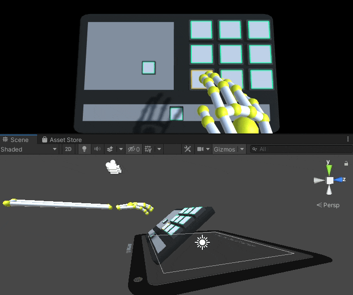

# Leap Tilt Five Testing
 Test scenes trying out different hand tracking interactions with [Tilt Five AR glasses](https://www.tiltfive.com/)

## Introduction
 This repo contains example scenes exploring HMD and Desktop-mode hand tracking with the [Tilt Five AR system](https://www.tiltfive.com/). Each mode represents an expected [Ultraleap tracking device](https://www.ultraleap.com/tracking/) orientation: mounted to the TiltFive glasses or laying next to the gameboard facing upward. The 'Chess Game' example demonstrates grid-snapping and object highlighting to help make the user intent clear when interacting. The 'Hand Cursor' example demonstrates two methods of projecting hand position onto the gameboard. The 'Turntable' example demonstrates how to rotate around a virtual object with either hand. Note that each example is designed around the device orientation and that some interactions are better suited for certain device orientations. For example, the chess game interaction would not work well in Desktop-mode because the hand often exceeds the field of view of camera when reaching over the board.

## Requirements:
 - Tilt Five Driver 1.1.0+
 - Unity 2019.4 LTS or later
 - Ultraleap Tracking Gemini 5.6+
 - (Tested on Windows with Ultraleap Unity plugin 5.10)

## Basic Scene Setup:
 - Ultraleap tracking uses the scale of 1 world unit = 1 real world meter. Set the 'Content Scale' in Tilt Five Manager' gameobject to 1 meter for reference
 - Tracking space alignment can be accomplished by either moving the 'Leap Rig' gameobject for Desktop examples, and adjusting the 'Device Origin' in LeapXRServiceProvider for HMD modes (e.g the chess example)
 - Instead of trying to align Tilt Five and Leap space and depending on touch interactions, mapping hand input to a virtual world action can improve interaction consistency.

## 3D Printed bracket (optional)
 For the HMD-mode tracked example such as the chess game, the Ultraleap device is mounted to the glasses. The STL files can be found in ["Assets > CAD Files"](/Assets/CAD%20Files) The mount prints with a consumer FDM printer with the following settings:
 - 0.2mm layer height
 - 3 perimeters
 - 10% infill
 - No supports
 - Skirt outlines or raft recommended

 The design includes sacrificial geometry instead of support material that needs to be removed (colored in orange in photo above). The mount adheres to the glasses using mounting tape, and the Ultraleap device is fastened using threadforming plastic screws and 3D printed bushings. See the BOM and 'SIR170_screw_adapter.stl' in ["Assets > CAD Files"](/Assets/CAD%20Files) for more info.

## Examples

 Note that each example is designed around the device orientation and that some interactions are better suited for certain device orientations. For example, the chess game interaction would not work well in Desktop-mode because the hand often exceeds the field of view of camera when reaching over the board. As an alternative, Hand Cursor scene demonstrates 2 methods of impelementing a virtual cursor to interact with your objects at a distance.

### Chess Game (HMD mode)
 Using Ultraleap hand tracking mounted to Tilt Five glasses, virtual gameboard are literally in reach. The user can grab and move pieces as they expect them to be in the real world. The interaction logic can be found on the 'Chess Game' gameobject under 'Tilt Five Game Board.' Note the use of proximity and pinch to determine the grab state of each gamepiece. This method is more predictable for the user than the sometimes explosive use of physics and colliders, as well as being forgiving in device alignment. The hand tracking 'Leap Service Provider' is on the 'Tilt Five Camera' gameobject. Note that alignment between hand and image can be adjusted by changing 'SIR170 Location' gameobject relative to 'Tilt Five Camera' gameobject.

### Hand Cursor (Desktop)
 The example scene demonstrates two methods of controlling a virtual cursor with your hands. Sometimes it's not practical to interact 1-to-1 with virtual objects and selecting from a distance is preferable. The script 'Hand 2D Projection' on the 'Leap Rig' maps two cursors to hand movements. The first is a direct mapping between hand position and cursor position. The second cursor is determined from a raycast starting from a virtual shoulder through users' index finger knuckle. This enables a more natural directionality to the cursor, and the cursor position becomes invariant to pinch gesture. Note that this example demonstrates a different world scaling ( Content Scale: 1 world unit = 5cm) in order to highlight the advantage of virtual cursors in the not world scale context.

### Turntable (Desktop)
 The Leap Turntable example uses the change in fingertip positions to calculate and apply a rotational velocity that dampens over time. The interaction zone where fingertips affect rotation can be customized using the table height and radius fields. The table can even have a tapered edge using 'Edge Angle' field to minimize change user rotates table inadvertently.

### 3D User Interface (Desktop)
 This scene physically simulates buttons and sliders for user to try. The virtual UI panel floats at an angle above the board, and requires a good alignment between the Tilt Five and Leap’s space to feel real. Simply moving the Desktop-mode tracking device can better align your hands. Note the different field of views between Ultraleap tracking devices and where they are located. Design your UI accordingly.

 